# Sulu Touch Shop

The workshop repository of Sulu Touch 2026: a merch catalogue for developers, built step by step on the
[Sulu product bundle](https://github.com/sulu/SuluProductBundle).
Every step is one commit on its own branch and one pull request onto the step before; each branch is the finished state of its step.

- **Slides** of the talk: [HTML](https://sulu.github.io/sulu-touch-2026-product/slides/talk.html), [PDF](slides/talk.pdf)
- **Cheatsheets**, one page per step: [HTML](https://sulu.github.io/sulu-touch-2026-product/cheatsheets/cheatsheets.html), [PDF](cheatsheets/cheatsheets.pdf), Markdown in `cheatsheets/`

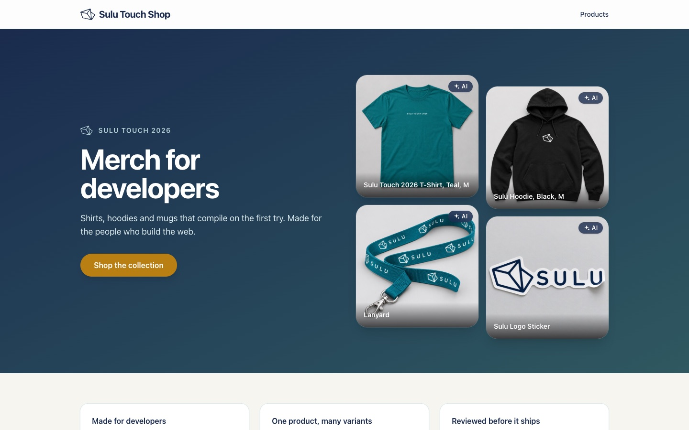

## The product bundle in short

- Products are content, like pages and articles: the same tabs (SEO, excerpt, URL, live preview) and the same lifecycle (draft, publish, versions, review).
- It is not a shop system: no cart, no prices, no checkout. It presents products, and a shop or PIM can feed it.
- Three types: a product, a product with variants, and a variant. A T-shirt holds the shared facts, each colour and size is a variant with its own photo and URL.
- An attribute is one typed fact: text, number with a unit, date, option or yes/no.
- A family decides which attributes a product has, and per attribute whether it is required and whether it varies per variant. Groups only arrange the attributes in the form and on the page.
- Associations link products, for example "Goes well with" and "Alternatives".
- An attribute marked filterable becomes a filter of the website search.

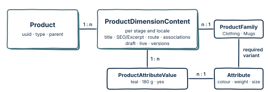

## Tour

**Website**

The product page: colour and size switch between the variants, each with its own URL; the attributes come grouped from the family (step 6).

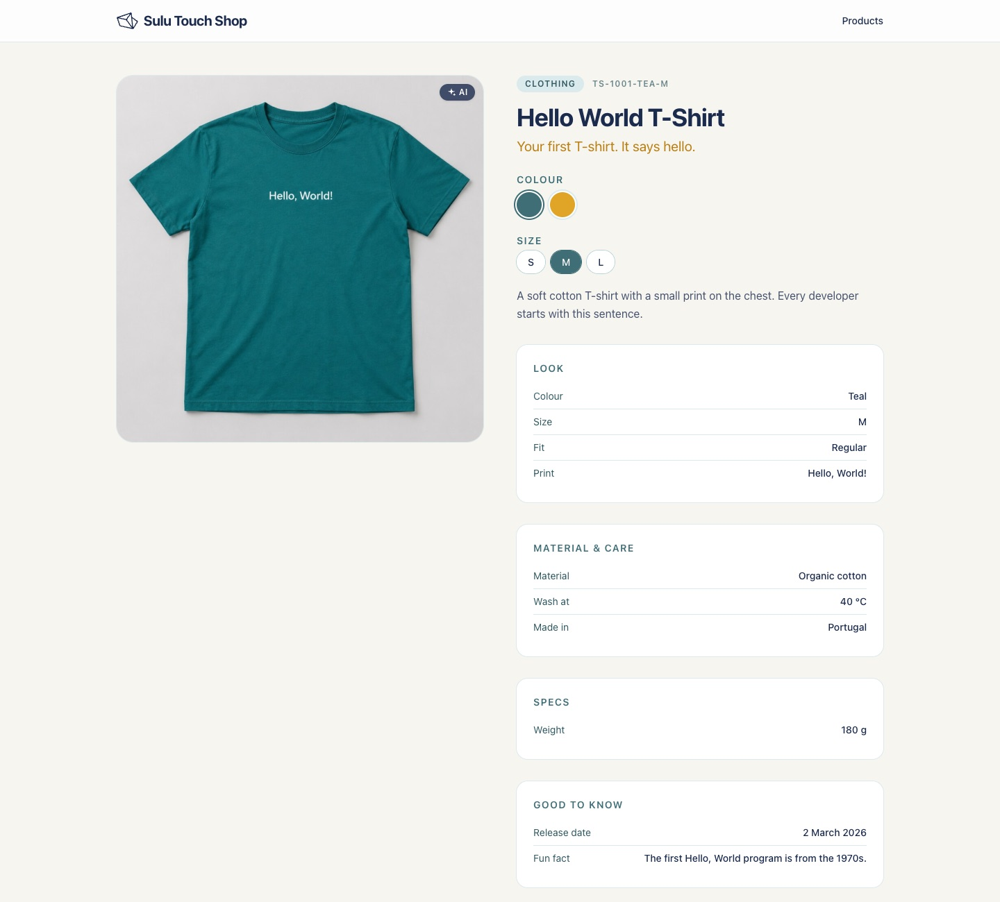

Associations resolved on the page: "Goes well with" and "Alternatives" (step 5).

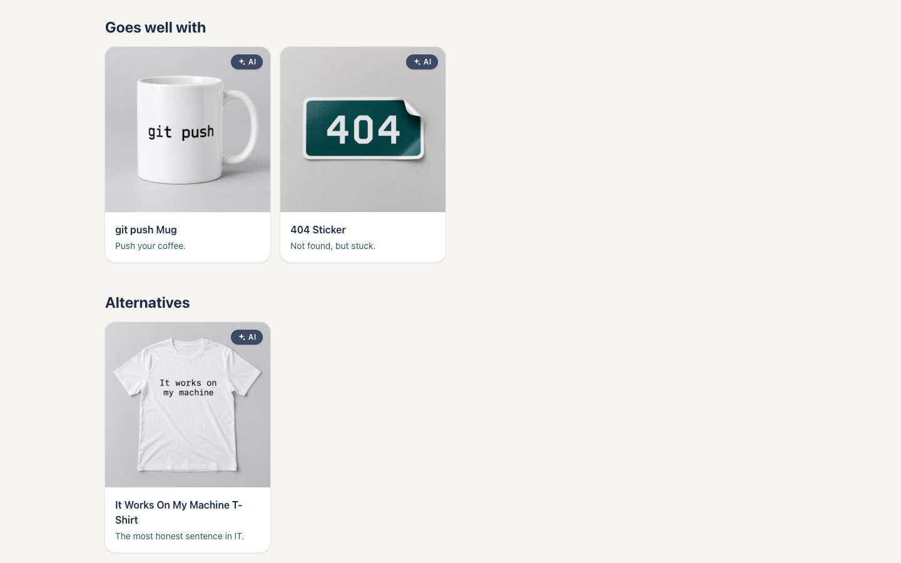

The catalogue: search and filters built from the filterable attributes. The URL holds the whole state (step 7).

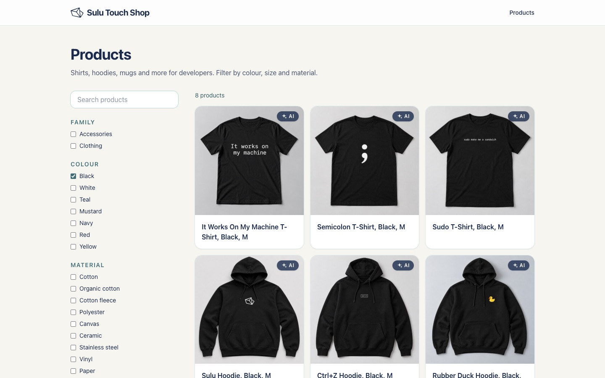

**Admin**

A product with the live preview next to the form (data from step 3, preview from step 4).

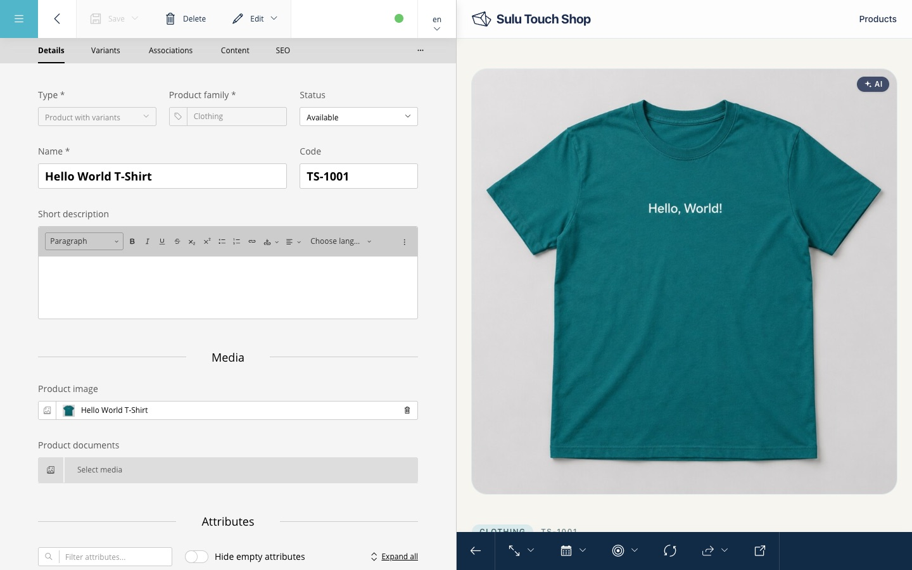

Its attributes, grouped as the family defines them (step 3).

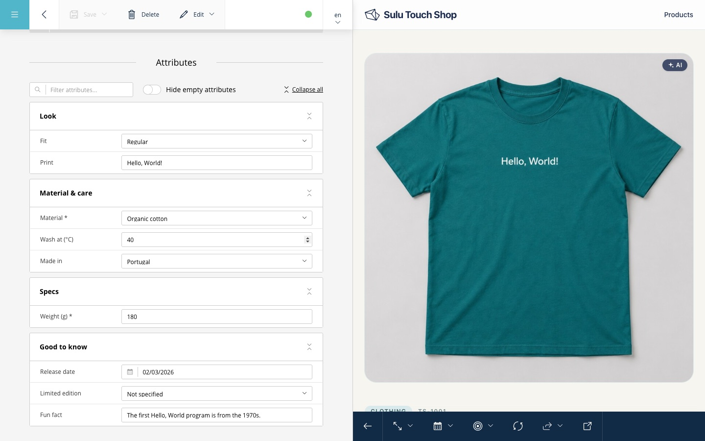

The family "Clothing": colour and size are the variant attributes, material is required (step 3).

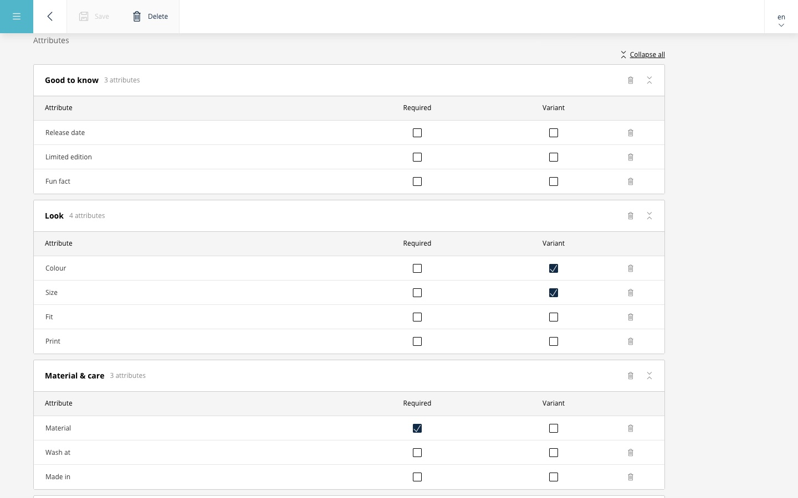

The variants of the product, one per colour and size (step 6).

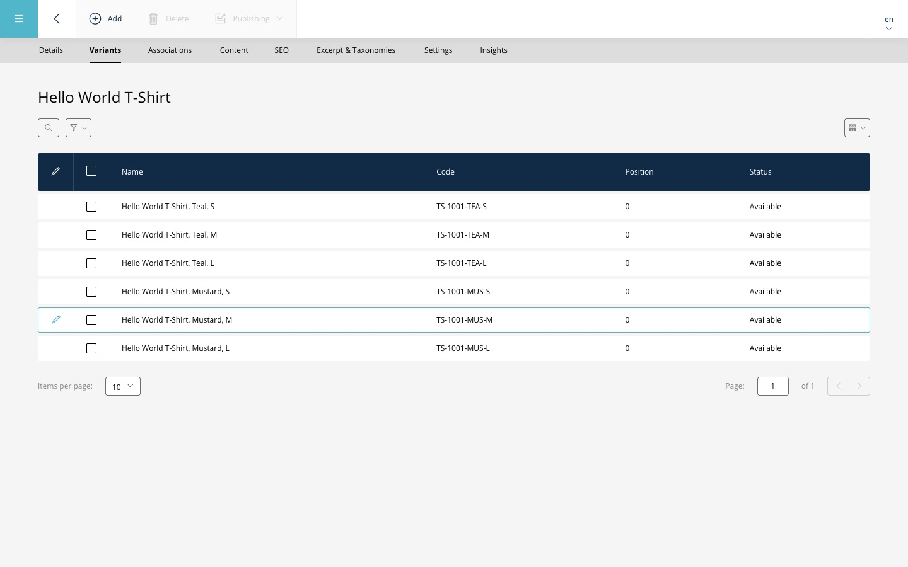

**Review before going live**

The AI editor of step 8 has no live permission. Its request locks the product until someone reviews it (step 9).

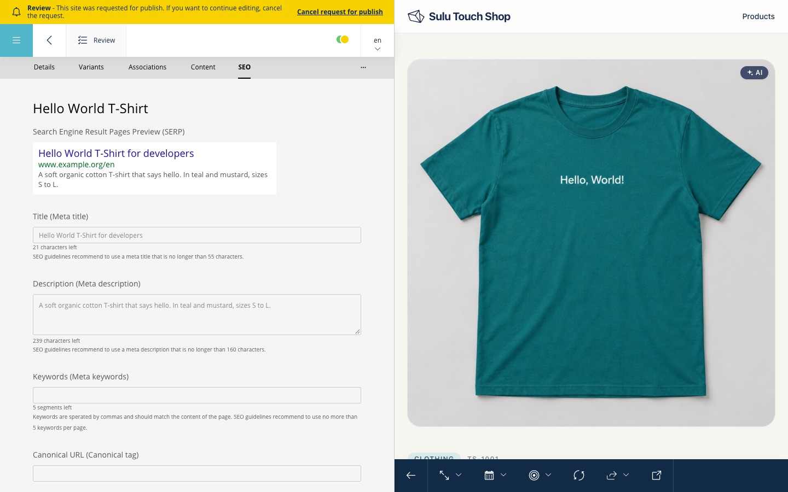

The reviewer approves or rejects. The review is configuration only, no code.

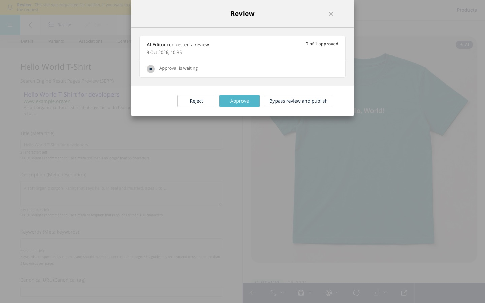

## Start

Requirements: PHP 8.2+, Composer, MySQL 8, the Symfony CLI. Set `DATABASE_URL` in `.env.local`.

```bash
git clone https://github.com/sulu/sulu-touch-2026-product.git && cd sulu-touch-2026-product
bin/stand 7          # step 7: switches the branch, installs, resets the data, starts the server
bin/stand 7 smoke    # the same, then checks what the step brings
```

The site runs at http://127.0.0.1:8123, the admin at http://127.0.0.1:8123/admin (`admin` / `admin`).
The reset takes up to two minutes from step 3 on, because it imports the catalogue.

## Steps

| Step | Branch | What you get | Pull request |
|---|---|---|---|
| 0 | `step-00-skeleton` | Show where we start: a fresh Sulu 3.1 skeleton. | start |
| 1 | `step-01-install` | Install the product bundle with three small changes and one config file. | [#1](https://github.com/sulu/sulu-touch-2026-product/pull/1) |
| 2 | `step-02-catalogue-data` | Explain the entities with real data: group, attributes, families, products. | [#2](https://github.com/sulu/sulu-touch-2026-product/pull/2) |
| 3 | `step-03-import-command` | Load the data with the same messages the admin uses. | [#3](https://github.com/sulu/sulu-touch-2026-product/pull/3) |
| 4 | `step-04-product-page` | Render a product on the website with Tailwind and Stimulus. | [#4](https://github.com/sulu/sulu-touch-2026-product/pull/4) |
| 5 | `step-05-associations` | Show accessories and alternatives on the product page, and show how little it takes to change what is resolved. | [#5](https://github.com/sulu/sulu-touch-2026-product/pull/5) |
| 6 | `step-06-variants` | One product, many variants: each with its own URL, colour, size and photo. | [#6](https://github.com/sulu/sulu-touch-2026-product/pull/6) |
| 7 | `step-07-catalogue-search` | A catalogue page with filters and a search box. The URL is the whole state. | [#7](https://github.com/sulu/sulu-touch-2026-product/pull/7) |
| 8 | `step-08-mcp` | Let an AI create a draft product, with the rights of a Sulu user. | [#8](https://github.com/sulu/sulu-touch-2026-product/pull/8) |
| 9 | `step-09-review-workflow` | A product needs a review before it goes live. This is only configuration. | [#9](https://github.com/sulu/sulu-touch-2026-product/pull/9) |

See what a step changed: `git diff step-02-catalogue-data step-03-import-command`.

## Check

- `bin/smoke`: resets the data of the checked out step and checks its pages.
